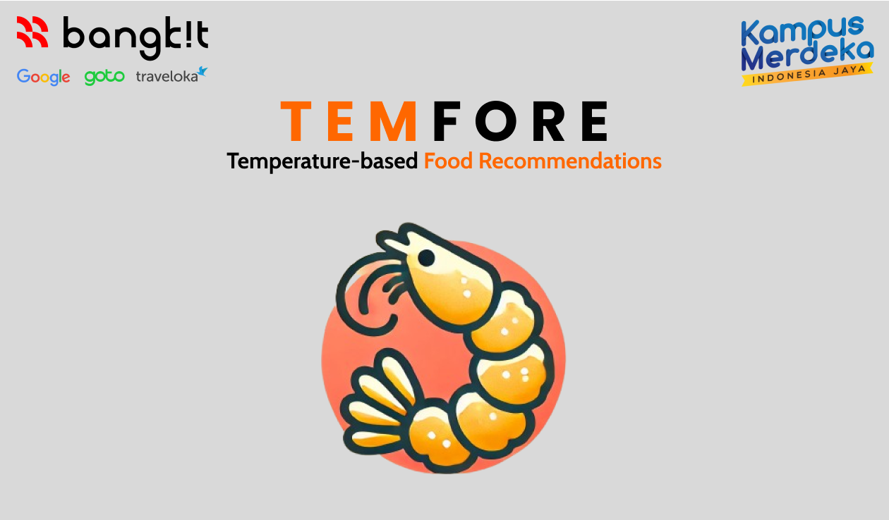

# Temfore: Temperature-based Food Recommendations

### About this project

Temfore is an innovative solution that provides recipe recommendations tailored to the user's local weather conditions, making meal planning easier and more enjoyable. Whether it's a chilly day calling for a warm, soupy dish or a hot day craving something fresh and light, Temfore ensures you always have the perfect recipe at hand.

**🛠️ Key Features:**

> - Weather-based recommendations: Get meal suggestions based on the current temperature.
> - Machine learning integration: Personalized recipes that adapt to user preferences and weather conditions.
> - Effortless recipe discovery: Find dishes that suit both the season and your mood, all in one app.

By integrating local weather data into the recipe discovery process, Temfore creates a cooking experience that aligns with the environment around you, offering a practical and personalized solution to your culinary needs.

## C242-PS547

### Team Members

| Status   | Path | Name                         | Bangkit ID     | University                    | LinkedIn                                                                        | GitHub                                        |
| -------- | ---- | ---------------------------- | -------------- | ----------------------------- | ------------------------------------------------------------------------------- | --------------------------------------------- |
| `Active` | (CC) | Nurminati Hasnatul Khatimah  | `C247B4KX2427` | Universitas Lambung Mangkurat | [LinkedIn](https://www.linkedin.com/in/nurminati-hasnatul-khatimah-704b69244/)  | [GitHub](https://github.com/minacloe)         |
| `Active` | (CC) | Muhammad Adji Maulana Putera | `C247B4KY2686` | Universitas Lambung Mangkurat | [LinkedIn](https://www.linkedin.com/in/muhammad-adji-maulana-putera-514066252/) | [GitHub](https://github.com/adjimaulanap)     |
| `Active` | (ML) | Balladiva Mahesi             | `M008B4KX0804` | Universitas Gadjah Mada       | [LinkedIn](https://www.linkedin.com/in/balladiva-mahesi-428a16256/)             | [GitHub](https://github.com/bldv)             |
| `Active` | (ML) | Alif Rahmatullah Lesmana     | `M668B4KY0386` | STMIK Palangka Raya           | [LinkedIn](https://www.linkedin.com/in/alif-rahmatullah-lesmana-565028311/)     | [GitHub](https://github.com/Peparrepair)      |
| `Active` | (ML) | Muhammad Raffa Saputra       | `M668B4KY2987` | STMIK Palangka Raya           | [LinkedIn](https://www.linkedin.com/in/muhammad-raffa-saputra21/)               | [GitHub](https://github.com/21YeetYa)         |
| `Active` | (MD) | Riyan Fazri Rahman           | `A668B4KY3894` | STMIK Palangka Raya           | [LinkedIn](https://www.linkedin.com/in/riyan-fazri-rahman/)                     | [GitHub](https://github.com/riyanfazrirahman) |

---

# **🔍 Comparison of Temfore's Advantages**

| **Key Features**                      | **Temfore** | **Similar Apps** | **Description**                                                                                            |
| ------------------------------------- | ----------- | ---------------- | ---------------------------------------------------------------------------------------------------------- |
| **Weather-Based Recommendations**     | ✔           | ✘                | Temfore uses real-time weather data, while similar apps do not consider weather conditions.                |
| **Machine Learning Integration**      | ✔           | ✘                | Temfore leverages ML for personalized recommendations, whereas other apps often rely on basic logic.       |
| **Meal Reminder Notifications**       | ✔           | ✘                | Meal reminders for breakfast, lunch, and dinner at specific times are not available in similar apps.       |
| **Recipe Search**                     | ✔           | ✔                | Both apps support recipe searches, but Temfore is more flexible by allowing searches by ingredients.       |
| **Favorite Recipes**                  | ✔           | ✘                | Favorite recipes in Temfore are accessible offline, while other apps often require an internet connection. |
| **User Interface (UI/UX)**            | ✔           | ✘                | Temfore features a modern and intuitive design, whereas many similar apps have complex interfaces.         |
| **API Efficiency**                    | ✔           | ✘                | Temfore combines weather and recommendation API calls, while similar apps often separate these processes.  |
| **User Login and Profile Management** | ✔           | ✘                | Temfore supports Firebase login and profile management, whereas many other apps are local-only.            |

## Conclusion

Temfore excels in providing weather-based recommendations, API efficiency, and additional features like notifications and personalized profile management.
